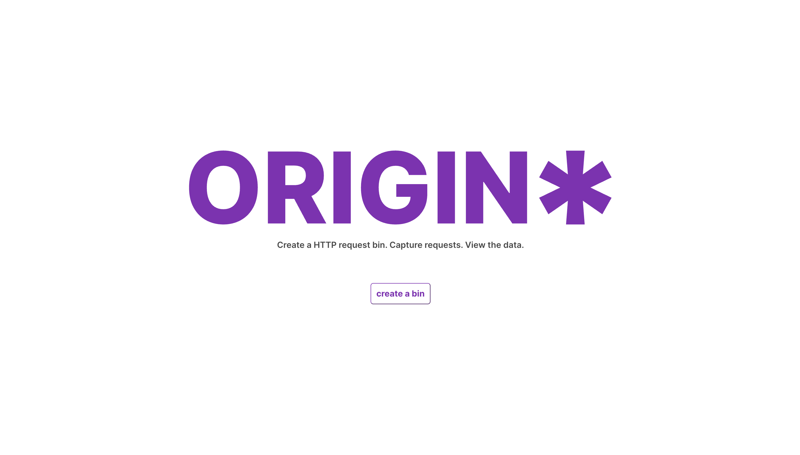
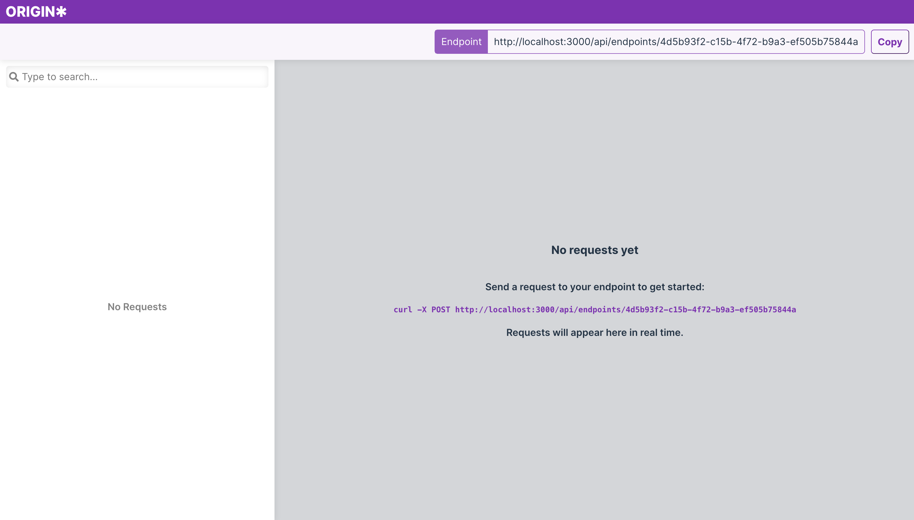
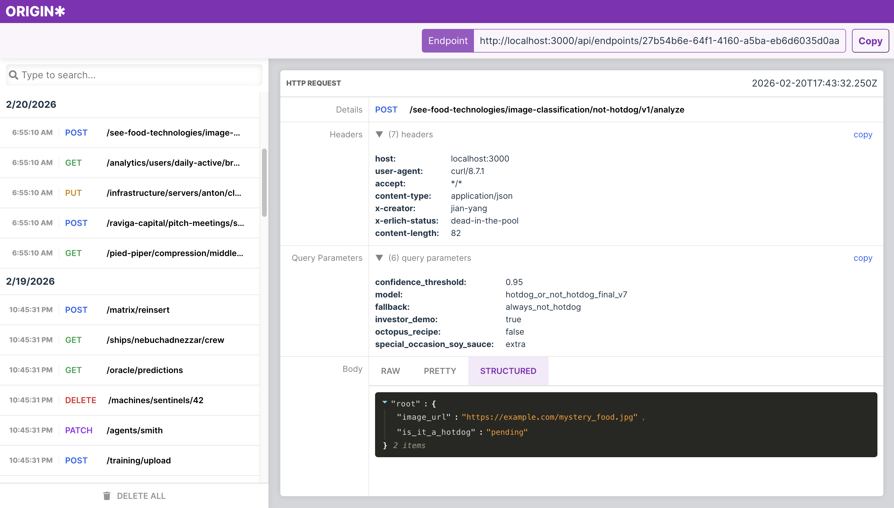

<p align="center">
  
</p>

<!-- # origin\* -->

> **origin** + **\*** — because it accepts requests from _any_ origin.

A RequestBin clone for collecting, inspecting, and debugging HTTP requests from webhooks and integrations.


---

## What is origin\*?

origin\* gives you a unique URL endpoint that captures any HTTP request sent to it — method, headers, body, query params, all of it. It's useful for debugging webhooks, testing API integrations, or just understanding what a third-party service is actually sending you.

---

## Features

- Generate unique bin URLs on demand
- Capture any HTTP method: GET, POST, PUT, DELETE, PATCH, etc.
- Inspect full request details: headers, body, query parameters, and timestamp
- Real-time request list updates
- Clean, minimal UI

---

## Screenshots





---

## Tech Stack

| Layer    | Technology        |
| -------- | ----------------- |
| Frontend | React             |
| Backend  | Node.js + Express |
| Styling  | CSS               |

---

## Getting Started

### Prerequisites

- Node.js 18+
- npm

### Installation

Clone the repo:

```bash
git clone https://github.com/cameronbibb/origin-splat.git
cd origin-splat
```

#### Backend

```bash
cd backend
npm install
npm start
```

The backend will run on `http://localhost:3000` by default.

#### Frontend

```bash
cd frontend
npm install
npm run dev
```

The frontend will run on `http://localhost:5173` by default.

---

## Usage

1. Open the app in your browser
2. Create a new bin — you'll get a unique URL
3. Send any HTTP request to that URL
4. Watch the request appear in the inspector with full details

> **Note:** To receive requests from external services or webhooks while running locally, you'll need to expose your local server publicly using a tool like [ngrok](https://ngrok.com). Alternatively, deploy the app to a live domain.

---

## License

MIT
